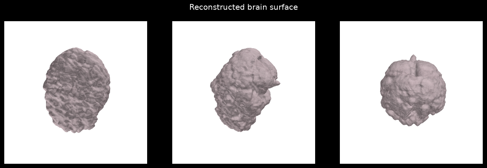
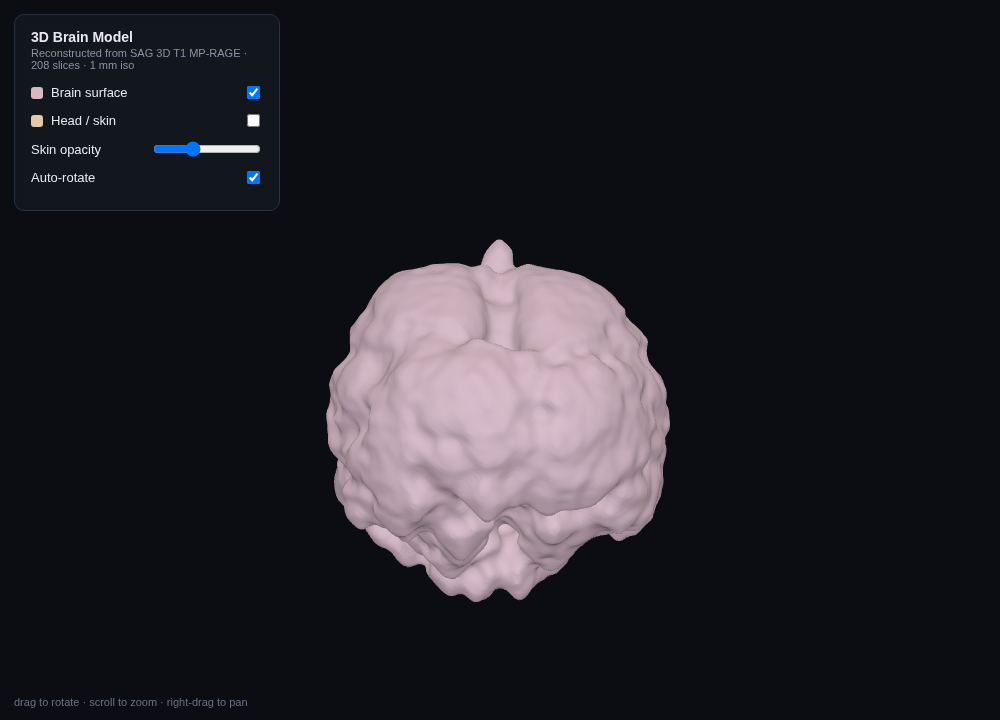
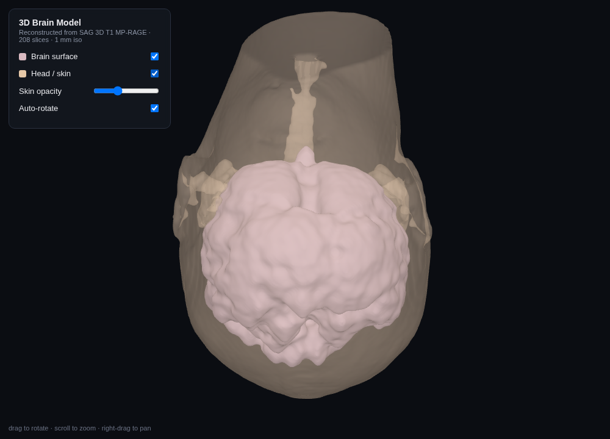
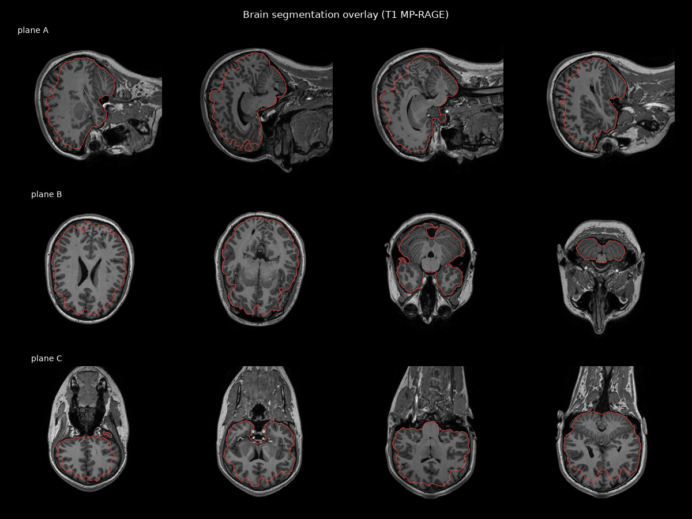

# 3D Brain Model — Head MRI (2025)

A 3D reconstruction of Calvin Gunther's brain and head, built from a routine
head MRI. The pipeline pulls the DICOM study, picks the best volumetric
sequence, assembles a 3D volume, segments the head and brain, and produces
printable/​web-ready surface meshes plus an interactive viewer.



## Interactive viewer

Open **[`out/viewer.html`](out/viewer.html)** in a browser (three.js is vendored
locally in `out/vendor/`, so it works offline — no CDN needed). You can toggle
the brain and head surfaces, fade the skin to see the brain inside, rotate,
zoom, and pan.

| Brain surface | Brain inside translucent head |
|---|---|
|  |  |

## The source data

The study is a standard "BRAIN ROUTINE" MRI (3 T, no contrast) exported as a
DICOM ISO bundle — **22 series, ~1,000 images**. Different sequences image the
*same* head with different contrast/orientation; you do **not** fuse them into
one mesh. Instead you reconstruct from the single best 3D isotropic sequence and
treat the rest as complementary views.

| Series | Description | Type | Slice | In‑plane | Use |
|--------|-------------|------|-------|----------|-----|
| 1 | LOC (localizer) | 2D | 15 mm | 0.94 mm | scout, skipped |
| **2** | **SAG 3D T1 MP‑RAGE** | **3D** | **1 mm** | **0.5 mm** | **← reconstructed from this** |
| 3–8, 10, 12 | T1/T2/FLAIR/DWI (2D) | 2D | 3–4 mm | — | clinical review |
| 9 | AX 3D SWAN (susceptibility) | 3D | 1.97 mm | 0.43 mm | veins/microbleeds |
| 11,15,16,21 | ASL / ADC / CBF maps | derived | — | — | perfusion/diffusion |
| 200/201 | MP‑RAGE reformats | derived | — | — | duplicate of series 2 |
| 22 | Structured report | SR | — | — | radiology report |

**Series 2 (SAG 3D T1 MP‑RAGE)** is the gold standard for surface
reconstruction: a true 3D acquisition, 208 slices, 1 mm × 0.5 mm × 0.5 mm,
covering the whole 256 mm head.

> **Clinical note (from the report in series 22):** 3 T brain MRI without
> contrast for abnormal movement / convulsive episodes — read as **normal, no
> acute intracranial findings**. This project is for visualization only and is
> **not** a diagnostic tool.

## Pipeline

```
Google Drive (Imaging/Gunther, Calvin/Head MRI w-o contrast 2025/dicom/SER00002)
        │   scripts/harvest.py         decode DICOMs pulled via the Drive MCP bridge
        ▼
data/dicom_staging/SER2/*.dcm  (208 slices)
        │   scripts/build_volume.py    sort by slice normal, apply rescale, record spacing
        ▼
data/volume_raw.npy  (208×512×512, 1.0×0.5×0.5 mm)
        │   scripts/reconstruct.py     resample→1 mm iso, segment, marching cubes
        ▼
out/{brain,skin}.{stl,glb}     +  scripts/render.py → preview PNGs
```

### Segmentation (no FSL/FreeSurfer/ANTs required)

* **Head / skin surface** — threshold the head against air, fill, keep the
  largest component. Clean and robust (traces the face, skull and neck).
* **Brain surface** — a pure‑morphology skull‑strip that exploits two facts of
  T1 imaging: the cortical skull is a dark signal void (a natural gap between
  brain and scalp), and orbital/scalp fat is *brighter* than brain tissue. We
  keep a gray/white‑matter intensity **band** (fat excluded, which removes the
  orbits — the usual leak path), erode to a compact brain core, keep the largest
  component, geodesically grow it back within the band, then **close + fill to
  the pial envelope** so the mask reaches the full cortical extent instead of
  dipping into every sulcus. Result ≈ 1360 cc — a complete adult brain with the
  cerebrum, cerebellum and brainstem and **no face leak**.

Segmentation quality was verified against the source slices:



## Outputs (`out/`)

| File | What |
|------|------|
| `viewer.html` (+ `vendor/`) | interactive three.js viewer (offline) |
| `brain.glb` / `brain.stl` | brain surface — web / 3D‑print |
| `skin.glb` / `skin.stl` | head‑and‑face surface — web / 3D‑print |
| `render_brain.png`, `render_head.png` | multi‑angle preview renders |
| `slices_overlay.png` | segmentation QC overlay on the MRI |

`.glb` for web/AR/Blender; `.stl` for 3D printing and CAD. Units are millimetres.

## Reproduce

```bash
pip install pydicom numpy scipy scikit-image trimesh matplotlib
# 1. DICOMs are pulled from Google Drive and decoded into data/dicom_staging/SER2/
#    (see scripts/harvest.py — bridges the Drive MCP download tool).
python3 scripts/build_volume.py     # -> data/volume_raw.npy + spacing.npy
python3 scripts/reconstruct.py      # -> out/{brain,skin}.{stl,glb}
python3 scripts/render.py           # -> out/*.png previews
```

The raw DICOM data and reconstructed volumes live under `data/`, which is
**git‑ignored** because it contains protected health information (patient name,
MRN, DOB in the DICOM headers). Only derived surface meshes and renders are
committed.
